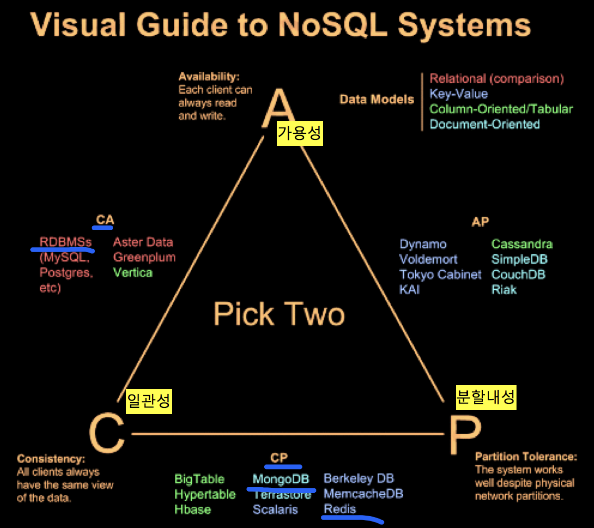

# MongoDB
NoSql 진영의 데이터베이스

- 크로스 플랫폼
- 도큐먼트(JSON과 같은 동적 스키마형 문서) 지향
- NoSQL(not only SQL) 데이터베이스 시스템
  - Key: Value 구조 'Redis'
  - JSON (java script object notation) 문서 'mongoDB'
  - 컬럼 패밀리 
  - 그래프
- 오픈소스(Open Source)
- C++ 기반
- 높은 확장성
- 높은 성능
- 더 쉽고 더 빠르게 데이터 통합 가능

## CAP 이론

위 세 가지 조건을 모두 만족하는 분산 컴퓨터 시스템이 존재하지 않음을 증명한 정리이다.

- CA 분류 (일관성 +가용성) : 전통적인 RDBMS. 트랜잭션. 
- CP 분류 (일관성+ 분할용인) :  구글의 BigTable, HBase 등
- AP 분류 (가용성 + 분할용인) : Dynamo, Cassandra, MongoDB 등


## MongoDB 세팅

homebrew 기반 설치
```
$ brew update
$ brew install mongodb
```

/data/db 폴더생성 (MongoDB의 기본 디렉토리 생성)
```
$ sudo mkdir -p /data/db
```

(실행 안될경우) 폴더 권한부여
```
$ sudo chown $USER /data/db
```

서비스 on
```
$ mongod 
```

콘솔관리자
```
$ mongo
MongoDB shell version v3.4.9
connecting to: mongodb://127.0.0.1:27017
MongoDB server version: 3.4.9
Welcome to the MongoDB shell.
...
...
...

> show dbs
admin  0.000GB
local  0.000GB

> db.member.insert({"id":"hong", "email":"hong@naver.com"})
WriteResult({ "nInserted" : 1 })

> show dbs
admin  0.000GB
local  0.000GB
test   0.000GB

> db.member.find()
{ "_id" : ObjectId("59bdda0780de78ad4bb78a75"), "id" : "hong", "email" : "hong@naver.com" }
```

## RDBMS vs MongoDB
 
| RDBMS         | MongoDB       |
| --------------| ------------- |
| Database      | Database      |
| Table         | Collection    |
| Row           | Document      |
| Column        | Key           |
| Primary Key   | ObjectId(_id) |
 
## SQL vs MongoDb
### Insert
- SQL
```sql
insert into members ("name","email") values("홍길동","hong@aaa.com")
```
- Mongo DB
```js
db.members.insert({name:"hong", email:"hong@aaa.com"})
```

### Select
- SQL
```sql
select * from members where name="홍길동"
```
- Mongo DB
```js
db.members.find({name:"홍길동"})
```

### Update
- SQL
```sql
update members set email="hong@aaa.com" where name="홍길동"
```
- Mongo DB
```js
db.members.update( {name:"홍길동"}, {$set :{email:"hong@aaa.com"} } )
```
 
### Delete
- SQL
```sql
delete from members where name="홍길동"
```
- Mongo DB
```js
db.members.remove({name:"홍길동"})
```

# REST API
| HTTP METHOD | 역할 | MongoDB 함수 |
|---|---|---|
| POST  | 리소스를 생성| insert, save |
| GET   | 리소스를 조회| find   |
| PUT   | 리소스를 수정| update |
| DELETE| 리소스를 삭제| delete |

# MEAN 스택
풀스택개발의 자주 사용되는 플랫폼

- MongoDB : 문서 기반의 NoSQL 데이터베이스.
- ExpressJS : Node.js에서 가장 널리 쓰이는 웹 프레임워크.
- AngularJS : 구글에서 개발한 MVC 기반 클라이언트 측 자바스크립트 프레임워크.
- Node.js : 자바스크립트 엔진 기반의 웹 서버.

## mongoose
```js
//몽구스 선언
const mongoose = require('mongoose');

//몽고db연결
mongoose.connect('mongodb://localhost/test');

const Cat = mongoose.model('Cat', {name: String});
const kitty = new Cat({name: '나비'});
//mongoose save
kitty.save(err => {
  if(err){
    console.log(err, '<< [ err ]');
  }else{
    console.log('[ 저장성공 ]');
  }
});
```
